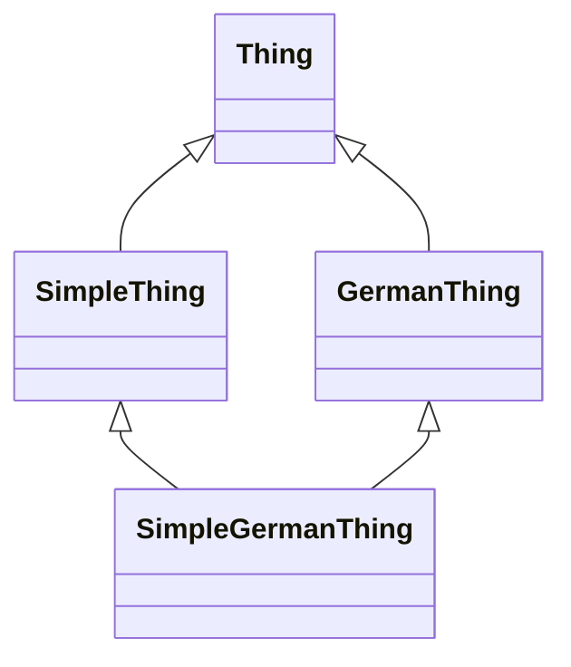

Python supports multiple inheritance, but 98% of the time you don't actually have to use it to solve everyday problems.
Therefore, it is not surprising that when you do, things usually don't go _quite_ as planned.

The same was true for a colleague of mine who wanted to create mixin-style subclasses that supply default arguments to its parent class.
The problem essentially boiled down to this:

```python
from pydantic import BaseModel

class Thing(BaseModel):
    # Some heavy-weight object needed to support features in a specific languages
    language_engine: object
    # Some parameter for an internal algorithm
    algorithm_parameter: int

class GermanThing(Thing):
    language_engine: object = object()  # initialize the engine for DE here

class SimpleThing(Thing):
    algorithm_parameter: int = 0

class SimpleGermanThing(SimpleThing, GermanThing):
    pass

x = SimpleGermanThing()
```

Sounds fairly straightforward, doesn't it?
Every `Thing` needs a language engine, but we don't want to put the burden of creating that engine on all subclasses individually.
For the same reason of keeping things simple for users of the code, we also want to supply default values for some of our algorithmic parameters.
However, we can't do that in the base class `Thing` since the defaults only make sense in a specific context and a different context might require different defaults.

Well, the problem is, the code doesn't work.
Pydantic model validation fails with the following error:

```plain
Traceback (most recent call last):
  File "/home/kylar/Documents/Freizeit/Projekte/schreiben/2017-08-arbitrary-but-fixed/assets/code/pydantic_diamond_inheritance/wrong_model.py", line 23, in <module>
    x = SimpleGermanThing()
  File "/home/kylar/Documents/Freizeit/Projekte/schreiben/2017-08-arbitrary-but-fixed/assets/code/pydantic_diamond_inheritance/.venv/lib/python3.13/site-packages/pydantic/main.py", line 250, in __init__
    validated_self = self.__pydantic_validator__.validate_python(data, self_instance=self)
pydantic_core._pydantic_core.ValidationError: 1 validation error for SimpleGermanThing
language_engine
  Field required [type=missing, input_value={}, input_type=dict]
    For further information visit https://errors.pydantic.dev/2.12/v/missing
```

It says that `SimpleGermanThing` needs a `language_engine` but the value for the field was missing.
This is odd.
`SimpleGermanThing` is a `GermanThing` and as such _should have_ a default value for `language_engine`.
What is going on here?

The first thing to check whenever you're dealing with multiple inheritance is method resolution order.
My colleague told me he checked that already, but let's do it anyway to understand the issue a bit better.
We'll start with the reason for needing to determine a method resolution order in the first place: the diamond problem.

## The diamond problem

With single inheritance, the class hierarchy is a tree, but with multiple inheritance, it becomes a directed acyclic graph.
This allows for weird structures like the one we created in our above example:



There are a few problems that arise with that, such as:

* There are multiple paths from `SimpleGermanThing` to `Thing`. So we need to somehow ensure that `Thing.__init__` is only called once.
* The same thing goes for any method: Implementations in subclasses might have to call implementations of the superclass. It has to be ensured that the child implementation is always called before the parent and each implementation is only called once.
* If both `SimpleThing` and `GermanThing` were to overwrite a method from `Thing` and _not_ call the superclass implementation, we have to decide which one to keep for `SimpleGermanThing`.

## Method resolution order

Python's solution to the diamond problem is to define a clear method resolution order (MRO) via [C3 linearization](https://docs.python.org/3/howto/mro.html):
Children are called before their parents and if multiple parents exist, they are called from left to right.

This is ensured by the magical `super()`.
In Pydantic, we don't _see_ how this is implemented, so let's move back to plain Python classes for a moment:

```python
class Thing:
    def __init__(self, language_engine: object, algorithm_parameter: int):
        print(f"Base({language_engine}, {algorithm_parameter})")
        self.language_engine = language_engine
        self.algorithm_parameter = algorithm_parameter


class GermanThing(Thing):
    def __init__(self, language_engine: object = object(), **kwargs):
        print(f"GermanThing({language_engine}, {kwargs})")
        super().__init__(language_engine=language_engine, **kwargs)


class SimpleThing(Thing):
    def __init__(self, algorithm_parameter: int = 0, **kwargs):
        print(f"SimpleThing({algorithm_parameter}, {kwargs})")
        super().__init__(algorithm_parameter=algorithm_parameter, **kwargs)


class SimpleGermanThing(SimpleThing, GermanThing):
    def __init__(self):
        print("SimpleGermanThing()")
        super().__init__()


val = SimpleGermanThing()

```

This prints the following:

```plain
SimpleGermanThing()
SimpleThing(None, 0)
GermanThing(None, 0)
Base(<object object at 0x7fdc99580200>, 0)
```

The problem is diamond inheritance, isn't it? You have this, right?

Python can deal with this if you follow the MRO correctly, yes, but that also only works if the init methods of all classes are designed for cooperative inheritance, meaning each init method can handle the inputs the previous init provides it and provides the inputs the next init requires. Now for Pydantic, everything depends on when the checks are done. If you were to check only at AbstractClass, yes, everything would be fine. But within the init method of AbstractClassX or AbstractClassY (whichever comes first), you actually have an inconsistent state because there are some fields which are supposed to have values but those values will only be supplied in the next init method (which is hard for the current init method to know about). If all the init method does is storing the input values, that's fine. But if you want to do any calculations based on them, you do have a problem and Pydantic is right to complain about that. Example code:

```python
class Base:
    def __init__(self, a: int | None, b: int | None, c: int | None):
        print(f"Base({a}, {b}, {c})")


class X(Base):
    def __init__(self, a: int | None = 1, b: int | None = None, c: int | None = None):
        print(f"X({a}, {b}, {c})")
        super().__init__(a if a is not None else 1, b, c)


class Y(Base):
    def __init__(self, a: int | None = None, b: int | None = 2, c: int | None = 3):
        print(f"Y({a}, {b}, {c})")
        super().__init__(a, b if b is not None else 2, c if c is not None else 3)


class Surface(X, Y):
    def __init__(self):
        print("Surface()")
        super().__init__()


val = Surface()
```

This prints the following:

```plain
Surface()
X(1, None, None)
Y(1, None, None)
Base(1, 2, 3)
```

So `X.__init__` cannot access `a` and `b` yet. Also, we only get the right values in the base class because all classes know about each other and decided to play nice with each other.

## Pydantic validators

## Solution: Decouple mixins from base class